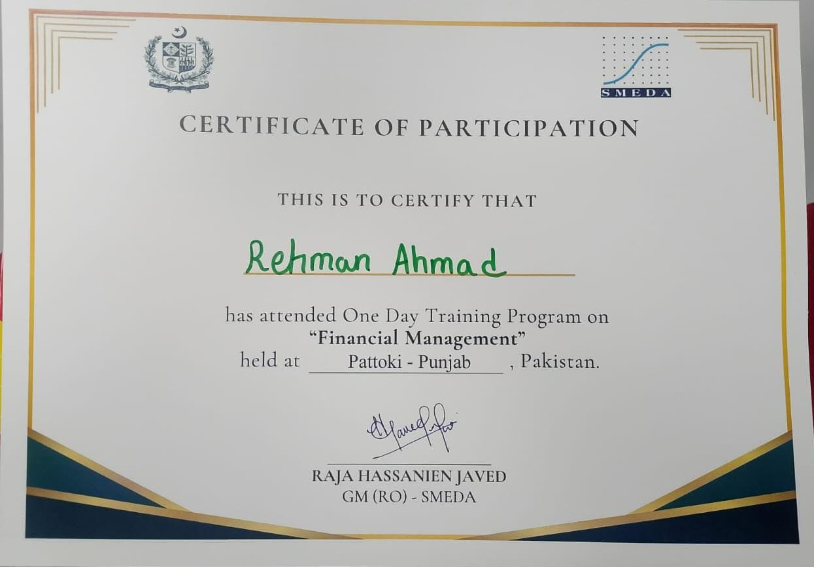

# Financial Management Training Certificate

## Overview
This repository contains my Certificate of Participation for a **One Day Training Program on "Financial Management"**, organized by the **Small and Medium Enterprises Development Authority (SMEDA)**.

## Certificate Details

| Field | Information |
|---|---|
| **Recipient** | Rehman Ahmad |
| **Program** | One Day Training Program on Financial Management |
| **Organized By** | SMEDA (Regional Office) |
| **Venue** | Pattoki, Punjab, Pakistan |
| **Issued By** | Raja Hassanien Javed, GM (RO) - SMEDA |

## About the Training
The training focused on core concepts of financial management, aimed at building practical skills relevant to business and entrepreneurial finance. It covered foundational principles useful for managing budgets, resources, and financial decision-making in professional and entrepreneurial settings.

## Certificate

## About Me
I'm Rehman Ahmad Cheema, a Computer Science undergraduate and AI/ML Engineer with a focus on backend development and applied AI. This certificate reflects my ongoing effort to build a well-rounded skill set beyond technical engineering, including business and financial literacy.

- 🔗 [LinkedIn](https://www.linkedin.com/in/rehmanahmad333)
- 🔗 [GitHub](https://github.com/RehmanAhmad333)
- 🔗 [Portfolio](https://rehmanahmad.online/)

---
*This repository is maintained to showcase professional development and continuous learning.*
